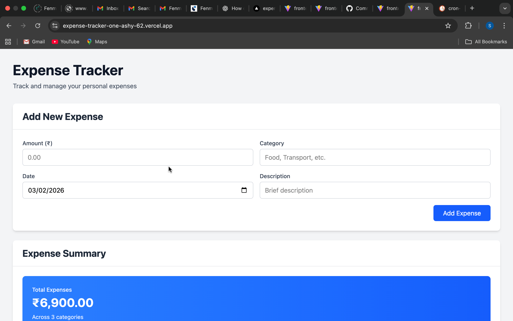
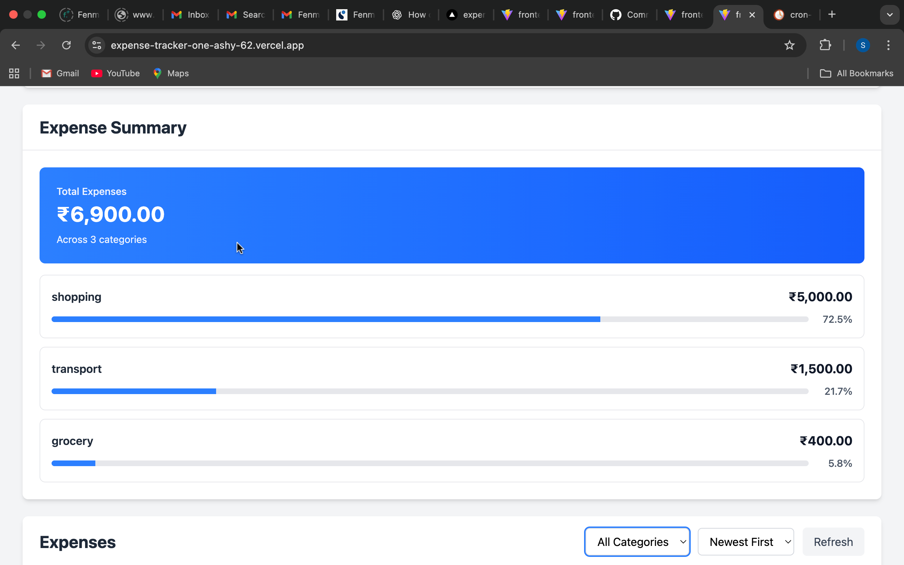
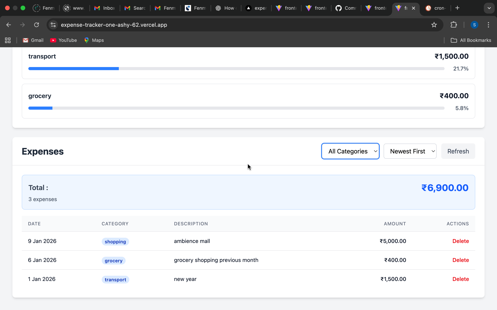

# Expense Tracker

A production-quality full-stack expense tracking application built with React and Node.js. Track personal expenses with category filtering, sorting, and analytics.

## Screenshots

### Expense Form


### Expense Summary


### Expense Filter


## Tech Stack

**Backend:**
- Node.js + Express.js
- MongoDB + Mongoose
- Zod (validation)
- ES Modules

**Frontend:**
- React 19 + Vite
- Tailwind CSS 4
- Axios

## Features

- ✅ Create expenses with amount, category, description, and date
- ✅ View expenses list with real-time total calculation
- ✅ Filter expenses by category
- ✅ Sort by date (newest/oldest first)
- ✅ Category-wise summary with percentage breakdown
- ✅ Delete expenses with confirmation
- ✅ Loading and error states
- ✅ Retry-safe form submissions
- ✅ Responsive design (mobile/tablet/desktop)
- ✅ Formatted currency (INR) and dates

## Setup

### Prerequisites
- Node.js 18+
- MongoDB (local or Atlas)

### Backend Setup

```bash
cd backend
npm install

# Configure environment
# Edit .env file with your MongoDB URI
MONGO_URI=mongodb://localhost:27017/expense-tracker
PORT=3000
NODE_ENV=development
CORS_ORIGIN=http://localhost:5173

# Start server
npm run dev  # development with nodemon
npm start    # production
```

### Frontend Setup

```bash
cd frontend
npm install

# Configure environment (optional)
# Edit .env file if API is on different host
VITE_API_URL=http://localhost:3000/api

# Start dev server
npm run dev
```

Visit `http://localhost:5173`

## API Endpoints

### POST /api/expenses
Create a new expense
```json
{
  "amount": 299.99,
  "category": "Food",
  "description": "Grocery shopping",
  "date": "2026-02-03T00:00:00.000Z"
}
```

### GET /api/expenses
Get all expenses with optional filters
- Query params: `category`, `sortBy` (date/amount/createdAt), `order` (asc/desc)
- Returns: expenses list with total and count

### DELETE /api/expenses/:id
Delete an expense by ID

## Project Structure

```
backend/
├── src/
│   ├── config/          # Database configuration
│   ├── controllers/     # Request handlers
│   ├── middlewares/     # Validation, error handling
│   ├── models/          # Mongoose schemas
│   ├── routes/          # API routes
│   ├── services/        # Business logic
│   ├── utils/           # Utilities (validation, errors)
│   ├── app.js          # Express app setup
│   └── server.js       # Server startup
└── package.json

frontend/
├── src/
│   ├── components/      # React components
│   ├── services/        # API communication
│   ├── App.jsx         # Main app
│   └── main.jsx        # Entry point
└── package.json
```

## Design Decisions

**Backend Architecture:**
- Separated concerns: routes → controllers → services → models
- Centralized error handling with custom ApiError class
- Zod validation at route level (before reaching controllers)
- Async handler wrapper eliminates try-catch boilerplate
- Money stored as decimal (validated to 2 places)

**Frontend Architecture:**
- Component-based structure with reusable Card component
- Axios instance with interceptors for error handling
- State management in App component (no external library needed)
- Optimistic UI updates for better UX
- Debounced auto-clear for error messages

**Validation:**
- Backend: Zod schemas for type-safe validation
- Frontend: HTML5 validation + axios error handling
- Prevents negative amounts, future dates, empty fields

**Real-World Considerations:**
- Idempotent operations (safe retries/refreshes)
- Disabled submit button during processing
- Network error detection with user-friendly messages
- Graceful shutdown handling on backend
- CORS configured for development
